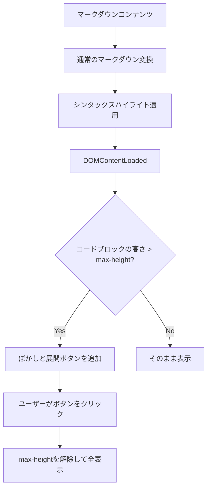

# コードブロック折りたたみ機能の改善計画

## 概要

長いコードブロックを折りたたんで表示する機能を、ビルド時処理からクライアントサイド処理に完全に移行する計画です。現在のremarkプラグインを削除し、純粋にフロントエンドでの実装に置き換えることで、シンタックスハイライトの問題を解決し、ユーザー体験を向上させます。

## 現状の課題

現在の実装（`web/scripts/remark-collapsible-code.js`）では、以下の問題があります：

1. コードブロックがビルド時に分割されるため、シンタックスハイライトが正常に機能しない
2. コードの構造が変更されるため、元のコードブロックの構造が失われる
3. ビルド時に処理されるため、柔軟性が低い

## 改善目標

1. シンタックスハイライトを正常に機能させる
2. コードブロックの構造を維持する
3. 完全にクライアントサイドでの処理に移行し、柔軟性を向上させる
4. ユーザー体験を向上させる（視覚的な一貫性を保つ）

## 実装フロー



## タスク分割

### フェーズ1: remarkプラグインの削除

- [x] 1.1 `remark-collapsible-code.js` の削除
- [x] 1.2 `astro.config.mjs` からプラグインの参照を削除

### フェーズ2: CSSの実装

- [x] 2.1 `blog-post.astro` のスタイル定義の更新
  - [x] 2.1.1 コードブロックの初期状態（max-height制限）の定義
  - [x] 2.1.2 長いコードブロック用のクラスの定義
  - [x] 2.1.3 ぼかしエフェクトの実装
  - [x] 2.1.4 展開ボタンのスタイル定義
  - [x] 2.1.5 展開状態のスタイル定義

### フェーズ3: JavaScriptの実装

- [x] 3.1 クライアントサイドスクリプトの作成
  - [x] 3.1.1 DOMContentLoaded時の処理の実装
  - [x] 3.1.2 長いコードブロックの検出ロジックの実装
  - [x] 3.1.3 展開ボタンの追加処理の実装
  - [x] 3.1.4 クリックイベントハンドラの実装

### フェーズ4: テストと調整

- [x] 4.1 ローカル環境でのテスト
  - [x] 4.1.1 様々な長さのコードブロックでの動作確認
  - [x] 4.1.2 シンタックスハイライトの確認
  - [x] 4.1.3 ボタンクリック時の挙動確認
- [x] 4.2 必要に応じた調整
  - [x] 4.2.1 max-heightの値の最適化
  - [x] 4.2.2 ぼかしエフェクトの視覚的調整
  - [x] 4.2.3 ボタンのデザイン調整

## 実装詳細

### CSS実装

```css
/* 初期状態のコードブロック */
.markdown pre {
  max-height: 300px; /* 適切な高さに調整 */
  overflow: hidden;
  position: relative;
}

/* 長いコードブロック用のクラス */
.markdown pre.collapsible-code {
  padding-bottom: 40px; /* ボタン用のスペース */
}

/* ぼかしエフェクト */
.markdown pre.collapsible-code::after {
  content: "";
  position: absolute;
  bottom: 0;
  left: 0;
  width: 100%;
  height: 60px;
  background: linear-gradient(to bottom, rgba(45, 45, 45, 0) 0%, rgba(45, 45, 45, 0.8) 70%, rgba(45, 45, 45, 1) 100%);
  pointer-events: none;
}

/* 展開ボタン */
.markdown .code-expand-button {
  position: absolute;
  bottom: 10px;
  left: 50%;
  transform: translateX(-50%);
  z-index: 10;
  background-color: rgba(60, 60, 60, 0.9);
  color: #e0e0e0;
  border: 1px solid rgba(100, 100, 100, 0.3);
  padding: 6px 12px;
  border-radius: 3px;
  font-size: 0.8em;
  cursor: pointer;
  font-family: 'JetBrains Mono', 'Fira Code', 'SF Mono', 'Menlo', 'Consolas', 'Courier New', monospace;
}

.markdown .code-expand-button:hover {
  background-color: rgba(80, 80, 80, 0.95);
  box-shadow: 0 2px 5px rgba(0, 0, 0, 0.3);
  transform: translateX(-50%) scale(1.02);
}

.markdown .code-expand-button:focus {
  outline: none;
  box-shadow: 0 0 0 1px #e0e0e0, 0 0 0 3px rgba(100, 100, 100, 0.5);
}

/* 展開状態 */
.markdown pre.expanded {
  max-height: none;
}

.markdown pre.expanded::after {
  display: none;
}

/* ダークモード用の調整 */
@media (prefers-color-scheme: dark) {
  .markdown .code-expand-button {
    background-color: rgba(50, 50, 50, 0.95);
    color: #e0e0e0;
    border-color: rgba(80, 80, 80, 0.4);
    box-shadow: 0 2px 5px rgba(0, 0, 0, 0.4);
  }

  .markdown .code-expand-button:hover {
    background-color: rgba(70, 70, 70, 1);
  }
}

/* ライトモード用の調整 */
@media (prefers-color-scheme: light) {
  .markdown pre.collapsible-code::after {
    background: linear-gradient(to bottom, rgba(45, 45, 45, 0) 0%, rgba(45, 45, 45, 0.8) 70%, rgba(45, 45, 45, 1) 100%);
  }
}
```

### JavaScript実装

```javascript
document.addEventListener("DOMContentLoaded", function() {
  // 長いコードブロックを検出
  const codeBlocks = document.querySelectorAll('.markdown pre');
  const MIN_HEIGHT = 300; // max-heightと同じ値
  const MIN_LINES = 20;   // 折りたたみを適用する最小行数

  codeBlocks.forEach(pre => {
    // コードブロック内のコード行数をカウント
    const codeElement = pre.querySelector('code');
    if (!codeElement) return;

    const lineCount = codeElement.textContent ? codeElement.textContent.split('\n').length : 0;

    // 行数が最小値以上、かつ実際の高さがmax-heightを超える場合のみ処理
    if (lineCount >= MIN_LINES && pre.scrollHeight > MIN_HEIGHT) {
      // 長いコードブロックとしてマーク
      pre.classList.add('collapsible-code');

      // 展開ボタンを追加
      const button = document.createElement('button');
      button.className = 'code-expand-button';
      button.textContent = 'コードをすべてみる';
      button.addEventListener('click', function() {
        pre.classList.add('expanded');
        button.style.display = 'none';
      });

      // ボタンを追加
      pre.appendChild(button);
    }
  });
});
```

## 利点

1. **シンタックスハイライトの保持**:
   - コードブロックが分割されないため、シンタックスハイライトが正常に機能
   - 言語ごとの適切なハイライトが適用される

2. **パフォーマンスの向上**:
   - ビルド時の処理が簡素化される
   - 必要な場合のみクライアント側で処理

3. **柔軟性の向上**:
   - ユーザーの環境に応じた調整が可能
   - 将来的な機能拡張が容易

4. **メンテナンス性の向上**:
   - コードがシンプルになり、理解しやすくなる
   - CSSとJavaScriptの分離により、スタイルの調整が容易

## 進捗記録

| 日付 | 完了したタスク | 備考 |
|------|--------------|------|
| 2025/03/10 | 計画の作成 | 実装計画の詳細を文書化 |
| 2025/03/10 | 計画の更新 | ユーザーフィードバックに基づき、remarkプラグインを完全に削除する方針に変更 |
| 2025/03/10 | フェーズ1の完了 | remarkプラグインの削除とastro.config.mjsの更新 |
| 2025/03/10 | フェーズ2の完了 | blog-post.astroにCSSを実装 |
| 2025/03/10 | フェーズ3の完了 | クライアントサイドJavaScriptの実装 |
| 2025/03/10 | フェーズ4の完了 | テストと調整、TypeScriptエラーの修正 |
| 2025/03/10 | 実装完了 | すべてのタスクを完了し、機能が正常に動作することを確認 |
