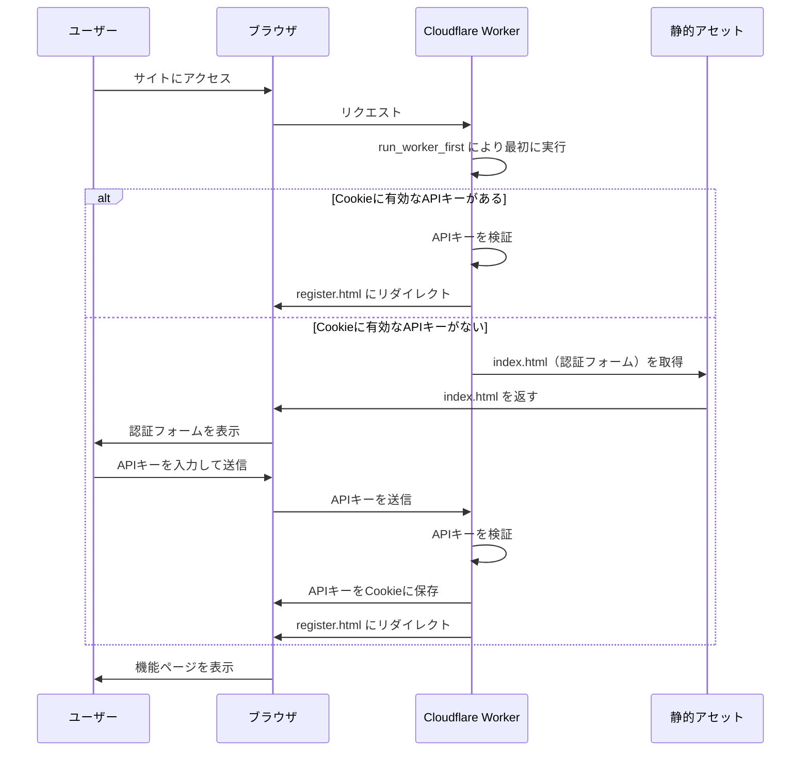

# 関連記事ワーカー認証機能実装計画

## 概要

`related-articles-worker/public/index.html` を機能ごとに分割し、認証機能を追加する計画です。

## 目標

1. `index.html` を認証用のページとする
2. 各機能を個別のHTMLファイルに分割する
3. `run_worker_first` を利用して認証処理を実装する
4. 認証済みの場合は適切なページにリダイレクトする

## ファイル構造

```
related-articles-worker/public/
├── index.html         # 認証用ページ
├── register.html      # 記事登録ページ
├── search.html        # 関連記事検索ページ
├── eyecatch.html      # 画像生成ページ
├── upload.html        # アイキャッチアップロードページ
├── direct-upload.html # ID指定アップロードページ
├── css/               # 共通スタイル
│   └── style.css
└── js/                # 共通スクリプト
    ├── auth.js        # 認証関連の共通処理
    └── common.js      # その他の共通処理
```

## タスク分割

### フェーズ1: 準備と共通ファイルの作成

- [x] 1.1 `.ai/plans` ディレクトリの作成
- [x] 1.2 共通スタイルの抽出
  - [x] 1.2.1 `public/css` ディレクトリの作成
  - [x] 1.2.2 現在の `index.html` からスタイルを抽出して `style.css` に移動
- [x] 1.3 共通スクリプトの抽出
  - [x] 1.3.1 `public/js` ディレクトリの作成
  - [x] 1.3.2 共通のJavaScriptを抽出して `common.js` に移動
  - [x] 1.3.3 認証関連のスクリプトを `auth.js` に作成

### フェーズ2: 認証ページの作成

- [x] 2.1 認証用の `index.html` の作成
  - [x] 2.1.1 シンプルな認証フォームの実装
  - [x] 2.1.2 APIキー入力フォームの作成
  - [x] 2.1.3 送信ボタンの実装
  - [x] 2.1.4 認証処理のスクリプト連携

### フェーズ3: 機能ページの分割

- [x] 3.1 記事登録ページ (`register.html`) の作成
  - [x] 3.1.1 現在の `index.html` から記事登録機能を抽出
  - [x] 3.1.2 共通スタイルとスクリプトの参照を追加
- [x] 3.2 関連記事検索ページ (`search.html`) の作成
  - [x] 3.2.1 現在の `index.html` から関連記事検索機能を抽出
  - [x] 3.2.2 共通スタイルとスクリプトの参照を追加
- [x] 3.3 画像生成ページ (`eyecatch.html`) の作成
  - [x] 3.3.1 現在の `index.html` から画像生成機能を抽出
  - [x] 3.3.2 共通スタイルとスクリプトの参照を追加
- [x] 3.4 アイキャッチアップロードページ (`upload.html`) の作成
  - [x] 3.4.1 現在の `index.html` からアイキャッチアップロード機能を抽出
  - [x] 3.4.2 共通スタイルとスクリプトの参照を追加
- [x] 3.5 ID指定アップロードページ (`direct-upload.html`) の作成
  - [x] 3.5.1 現在の `index.html` からID指定アップロード機能を抽出
  - [x] 3.5.2 共通スタイルとスクリプトの参照を追加

### フェーズ4: ワーカーの更新

- [x] 4.1 `wrangler.jsonc` の更新
  - [x] 4.1.1 `assets` セクションに `run_worker_first: true` を追加
- [x] 4.2 `index.ts` の更新
  - [x] 4.2.1 認証処理の追加
  - [x] 4.2.2 リダイレクト処理の追加
  - [x] 4.2.3 各ページへのアクセス時の認証チェック処理の追加

### フェーズ5: テストと調整

- [x] 5.1 ローカル環境でのテスト
  - [x] 5.1.1 認証機能のテスト
  - [x] 5.1.2 リダイレクト機能のテスト
  - [x] 5.1.3 各機能ページの動作確認
- [x] 5.2 必要に応じた調整
  - [x] 5.2.1 認証処理の調整
  - [x] 5.2.2 UI/UXの調整（autocomplete属性の追加、faviconの追加）
  - [x] 5.2.3 エラーハンドリングの強化

## 実装詳細

### 認証ページ（index.html）

```html
<!DOCTYPE html>
<html lang="ja">
<head>
    <meta charset="UTF-8" />
    <meta name="viewport" content="width=device-width, initial-scale=1.0" />
    <title>関連記事API - 認証</title>
    <link rel="stylesheet" href="css/style.css">
    <link rel="icon" href="image1.png" type="image/png">
</head>
<body>
    <div class="auth-container">
        <h1>関連記事API 認証</h1>
        <form id="authForm">
            <div class="form-group">
                <label for="apiKey">API Key:</label>
                <input type="password" id="apiKey" autocomplete="current-password" required>
            </div>
            <button type="submit">ログイン</button>
        </form>
        <div id="authResult" class="result"></div>
    </div>
    <script src="js/auth.js"></script>
</body>
</html>
```

### 認証スクリプト（auth.js）

```javascript
document.addEventListener('DOMContentLoaded', () => {
    const authForm = document.getElementById('authForm');

    if (authForm) {
        authForm.addEventListener('submit', async (e) => {
            e.preventDefault();
            const apiKey = document.getElementById('apiKey').value;

            if (!apiKey) {
                showError('APIキーを入力してください');
                return;
            }

            try {
                // APIキーの検証リクエスト
                const response = await fetch('/validate_api_key', {
                    method: 'POST',
                    headers: {
                        'Content-Type': 'application/json',
                        'X-API-Key': apiKey
                    }
                });

                if (!response.ok) {
                    throw new Error('APIキーが無効です');
                }

                // APIキーをCookieに保存（有効期限は1日）
                document.cookie = `apiKey=${apiKey}; path=/; max-age=86400; SameSite=Strict`;

                // 記事登録ページにリダイレクト
                window.location.href = '/register.html';
            } catch (error) {
                showError(error.message);
            }
        });
    }

    function showError(message) {
        const resultDiv = document.getElementById('authResult');
        if (resultDiv) {
            resultDiv.textContent = `エラー: ${message}`;
            resultDiv.classList.add('error');
        }
    }
});
```

### ワーカーの認証処理（index.ts）

```typescript
// 認証処理の追加
function isAuthenticated(request: Request, env: Env): boolean {
  // Cookieからのキー取得
  const cookies = request.headers.get('Cookie') || '';
  const apiKeyCookie = cookies.split(';').find(c => c.trim().startsWith('apiKey='));
  const apiKey = apiKeyCookie ? apiKeyCookie.split('=')[1].trim() : null;

  // APIキーの検証
  return apiKey === env.API_KEY;
}

// リクエスト処理の修正
export default {
  async fetch(request: Request, env: Env, ctx: ExecutionContext): Promise<Response> {
    const url = new URL(request.url);
    const path = url.pathname;

    // APIキー検証エンドポイント
    if (path === "/validate_api_key" && request.method === "POST") {
      const apiKey = request.headers.get('X-API-Key');
      if (apiKey === env.API_KEY) {
        return new Response(JSON.stringify({ success: true }), {
          headers: { "Content-Type": "application/json" }
        });
      } else {
        return new Response(JSON.stringify({ error: "Invalid API key" }), {
          status: 401,
          headers: { "Content-Type": "application/json" }
        });
      }
    }

    // 認証チェック（index.html、CSS、JS、関連記事API、アイキャッチ画像へのアクセスは除外）
    if (path !== '/' && path !== '/index.html' &&
        !path.startsWith('/css/') && !path.startsWith('/js/') &&
        path !== '/related_articles' && path !== '/eyecatch') {
      if (!isAuthenticated(request, env)) {
        // 未認証の場合はindex.htmlにリダイレクト
        return Response.redirect(`${url.origin}/`, 302);
      }
    } else if (path === '/' || path === '/index.html') {
      // index.htmlへのアクセスで認証済みの場合はregister.htmlにリダイレクト
      if (isAuthenticated(request, env)) {
        return Response.redirect(`${url.origin}/register.html`, 302);
      }
    }

    // 既存のAPIエンドポイント処理
    // ...（既存のコード）

    // 静的アセットの提供（認証チェック後）
    return env.ASSETS.fetch(request);
  }
}
```

### wrangler.jsonc の更新

```jsonc
{
  // ...（既存の設定）
  "assets": {
    "binding": "ASSETS",
    "directory": "./public",
    "run_worker_first": true
  },
  // ...（その他の設定）
}
```

## 認証フロー



## 進捗記録

| 日付 | 完了したタスク | 備考 |
|------|--------------|------|
| 2025/03/09 | フェーズ1〜4の全タスク完了 | 認証機能の実装、機能ページの分割、ワーカーの更新が完了。 |
| 2025/03/09 | フェーズ5の全タスク完了 | 認証機能のテスト、リダイレクト機能のテスト、各機能ページの動作確認を実施。UI/UXの調整として、パスワード入力フィールドにautocomplete属性を追加し、faviconを追加。 |
| 2025/03/10 | 認証チェックの修正 | `/related_articles` と `/eyecatch` エンドポイントを認証チェックから除外し、ブログの訪問者が認証なしでアクセスできるようにした。テストを追加して動作を確認。 |
