# yaakai.to ウェブサイトリデザイン計画

## 全体コンセプト

- グレースケールをベースにした、赤色アクセントのモダンなデザイン
- ブログとノートを視覚的に区別するレイアウト
- ブログ記事を大きく表示し、ノートをコンパクトに表示
- ダークモードとライトモード両対応
- YouTubeチャンネルページのようなカテゴリ分けのある構造

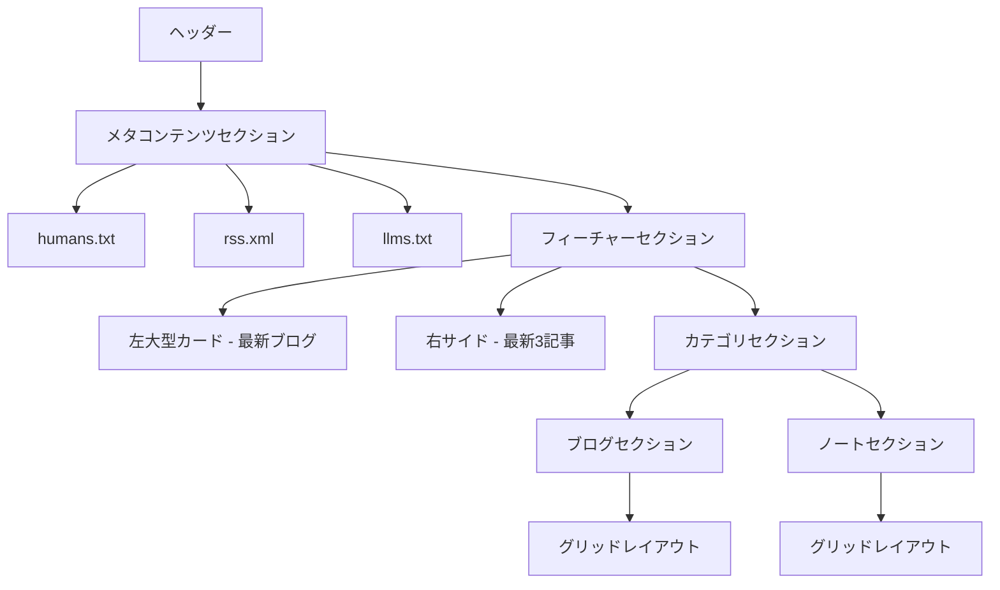

## カラースキーム

```css
:root {
  /* グレースケールパレット - ライトモード */
  --gray-100: #FFFFFF;
  --gray-200: #F9F9F9;
  --gray-300: #F0F0F0;
  --gray-400: #E0E0E0;
  --gray-500: #C0C0C0;
  --gray-600: #808080;
  --gray-700: #505050;
  --gray-800: #303030;
  --gray-900: #121212;

  /* アクセントカラー - 赤色系 */
  --red-500: #E53935;
  --red-600: #D32F2F;
  --red-700: #C62828;

  /* 機能的な色の割り当て */
  --bg-color-level-0: var(--gray-100);
  --bg-color-level-1: var(--gray-200);
  --bg-color-level-2: var(--gray-300);
  --bg-color-level-3: var(--gray-400);
  --bg-color-level-4: var(--gray-500);

  --text-color-level-0: var(--gray-900);
  --text-color-level-1: var(--gray-800);
  --text-color-level-2: var(--gray-700);

  --primary-color-level-0: var(--red-600);
  --primary-color-level-1: var(--red-500);
  --primary-color-level-2: var(--red-700);

  /* コンテンツタイプ識別色 */
  --blog-color: var(--red-600);
  --note-color: var(--gray-600);
}

@media (prefers-color-scheme: dark) {
  :root {
    /* ダークモード用の色の割り当て */
    --bg-color-level-0: #121212;
    --bg-color-level-1: #1E1E1E;
    --bg-color-level-2: #2D2D2D;
    --bg-color-level-3: #353535;
    --bg-color-level-4: #424242;

    --text-color-level-0: #FFFFFF;
    --text-color-level-1: #E0E0E0;
    --text-color-level-2: #BDBDBD;

    --primary-color-level-0: #F44336;
    --primary-color-level-1: #EF5350;
    --primary-color-level-2: #E53935;

    /* ダークモードでのコンテンツタイプ識別色 */
    --blog-color: #FF5252;
    --note-color: #A0A0A0;
  }
}
```

## コンポーネント設計

### 1. ヘッダー
- シンプルなナビゲーション
- サイト名とアイコン
- ブログとノートへのリンク

### 2. メタコンテンツセクション
- humans.txt セクションの表示（現在と同様の表示スタイル）
- humans.md の内容を表示
- rss.xml へのリンクを追加
- llms.txt へのリンクを追加
- メタコンテンツへのリンクを視覚的にまとめて配置

### 3. フィーチャーセクション
- 非対称グリッドレイアウト
- 左側に大きなカード（最新ブログ記事）
- 右側に3つの小さなカード（最新記事）
- グリッドベースで水平スクロールなし

```css
.feature-section {
  display: grid;
  grid-template-columns: 3fr 2fr;
  gap: 24px;
  margin-bottom: 48px;
}

.feature-main {
  grid-column: 1;
  grid-row: span 3;
}

.feature-sub {
  grid-column: 2;
  display: flex;
  flex-direction: column;
  gap: 16px;
}
```

### 4. カテゴリセクション
- 各カテゴリごとのセクション（ブログ、ノートなど）
- カテゴリ名と「もっと見る」リンクを含むヘッダー
- レスポンシブグリッドレイアウト
- コンテンツタイプの視覚的区別

```css
.category-section {
  margin-bottom: 48px;
}

.category-header {
  display: flex;
  justify-content: space-between;
  align-items: center;
  margin-bottom: 24px;
}

.category-grid {
  display: grid;
  grid-template-columns: repeat(auto-fill, minmax(250px, 1fr));
  gap: 24px;
}
```

### 5. カードデザイン

#### ブログカード
- 大きな画像/サムネイル
- 赤色アクセントのインジケーター
- タイトル、日付、概要テキスト

#### ノートカード
- コンパクトなデザイン
- グレースケールベース
- 絵文字とタイトルを主体に

## レスポンシブデザイン

### デスクトップ (1024px以上)
- フィーチャーセクション：非対称グリッド (3:2)
- カテゴリグリッド：4列

### タブレット (768px - 1023px)
- フィーチャーセクション：非対称グリッド (3:2)
- カテゴリグリッド：2-3列

### モバイル (768px未満)
- フィーチャーセクション：1列
- カテゴリグリッド：1列

# 実装プラン

## コンポーネント構造について

Astro Contentsは使わず、コンポーネントは以下のように実装します：

1. **src/components ディレクトリを新規作成**：
   - 再利用可能なUI要素をコンポーネントとして実装
   - 各コンポーネントは独立した.astroファイルとして作成

2. **コンポーネント名の例**：
   - `BlogCard.astro`
   - `NoteCard.astro`
   - `FeatureGrid.astro`
   - `CategorySection.astro`

## ディレクトリ構造

```
src/
├── components/     <- 新規作成
│   ├── BlogCard.astro
│   ├── NoteCard.astro
│   ├── FeatureGrid.astro
│   └── CategorySection.astro
├── layouts/        <- 既存
│   ├── global-layout.astro
│   └── blog-post.astro
└── pages/          <- 既存
    ├── index.astro
    ├── blog/
    └── note/
```

## 実装の優先順位

1. **グローバルスタイルの更新**
   - カラースキームの変更
   - 基本レイアウト構造の改善
   - タイポグラフィの更新

2. **コアコンポーネントの作成**
   - カードデザイン
   - グリッドレイアウト
   - セクションヘッダー

3. **トップページの再構築**
   - フィーチャーグリッド
   - カテゴリセクション
   - レスポンシブデザイン対応

4. **各ページの更新**
   - ブログインデックスページ
   - ノートインデックスページ
   - 記事詳細ページ

## 詳細実装ステップ

### フェーズ1: グローバルスタイルとレイアウトの更新

#### 1-1. カラースキームの更新
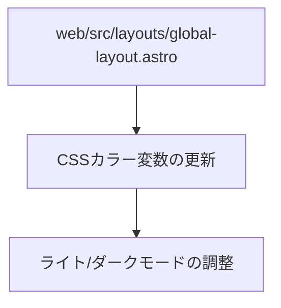

**作業内容:**
- `web/src/layouts/global-layout.astro` ファイルの CSS 変数を更新
- グレースケールベースのカラーパレットを実装
- 赤色アクセントカラーの設定
- ブログとノートの識別色の設定

#### 1-2. 基本レイアウトの更新
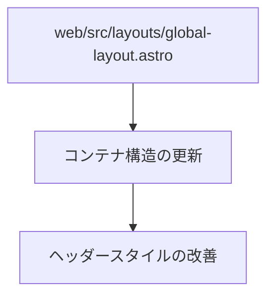

**作業内容:**
- ページ全体のコンテナサイズと余白の調整
- ヘッダーのデザイン更新
- 基本的なグリッドレイアウトの準備

### フェーズ2: コンポーネントの作成

#### 2-1. カードコンポーネントの作成
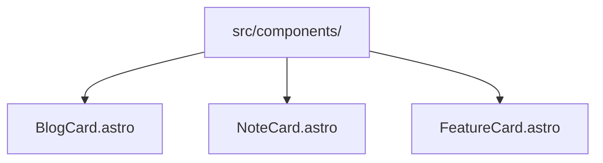

**作業内容:**
- `src/components/` ディレクトリを作成
- ブログ用カードコンポーネントの実装
- ノート用カードコンポーネントの実装
- フィーチャーセクション用の大型カードコンポーネントの実装

#### 2-2. セクションコンポーネントの作成
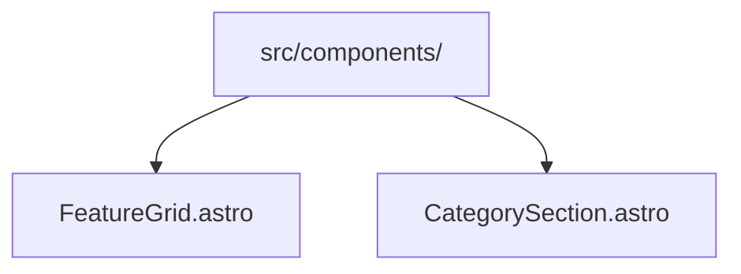

**作業内容:**
- フィーチャーグリッドコンポーネントの実装
- カテゴリセクションコンポーネントの実装
- 各セクションのレスポンシブデザイン対応

### フェーズ3: トップページの再構築

#### 3-1. メタコンテンツセクションの更新
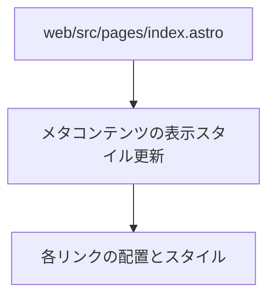

**作業内容:**
- humans.txt セクションのスタイルを更新
- rss.xml と llms.txt へのリンクを追加
- メタコンテンツをグループとして視覚的にまとめる
- 新しいデザインテーマに合わせたスタイル調整

#### 3-2. フィーチャーセクションの実装
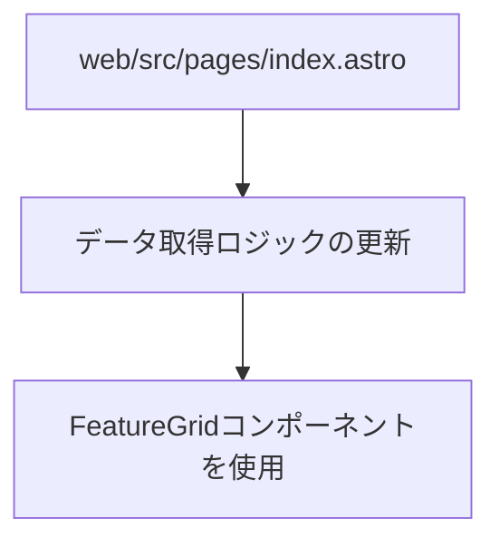

**作業内容:**
- ブログとノートの記事データ取得ロジックの改善
- 最新記事を取得して、左側に最新ブログ、右側に残りの最新記事を配置
- フィーチャーグリッドコンポーネントを使用して表示

#### 3-3. カテゴリセクションの実装
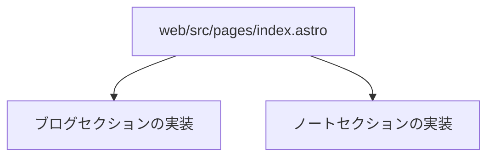

**作業内容:**
- ブログ記事用のカテゴリセクション実装
- ノート用のカテゴリセクション実装
- CategorySectionコンポーネントを使用して表示

### フェーズ4: 各ページの更新

#### 4-1. ブログページの更新
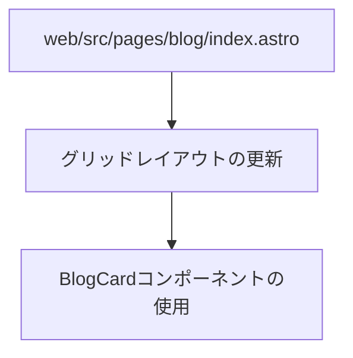

**作業内容:**
- ブログインデックスページのレイアウト更新
- カテゴリフィルターの追加（将来機能）
- BlogCardコンポーネントを使用した記事表示

#### 4-2. ノートページの更新
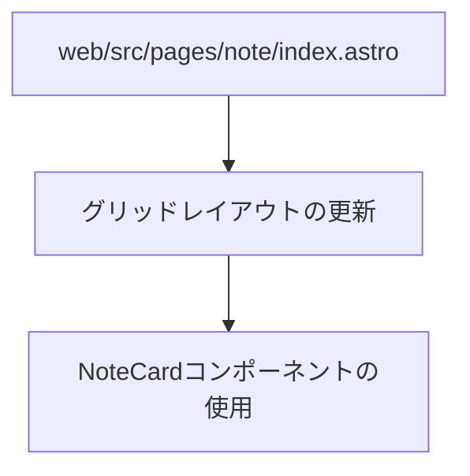

**作業内容:**
- ノートインデックスページのレイアウト更新
- NoteCardコンポーネントを使用した記事表示

### フェーズ5: 詳細ページとレスポンシブ対応

#### 5-1. 記事詳細ページの更新
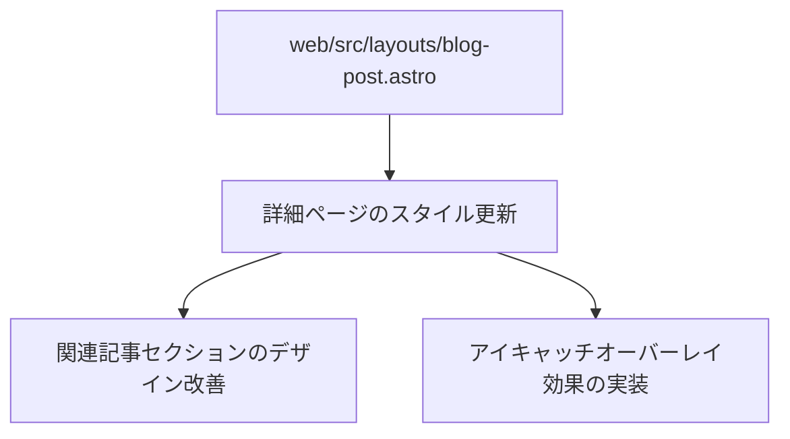

**作業内容:**
- 記事詳細ページのレイアウト更新
- Markdownスタイルの調整
- 関連記事セクションのデザイン改善
- アイキャッチ画像のオーバーレイ視覚効果実装:
  1. `.article-header`のbottomパディングを削除し、アイキャッチ下部がヘッダー終端と合うよう調整
  2. `.eyecatch-container`には`z-index: 10`を設定して前面表示
  3. 別要素として`.overlay-background`を実装し、`position: absolute`と`z-index: 5`で配置
  4. 高さ80pxのオーバーレイ背景で2つの背景色の境界をまたぐ効果を実現

#### 5-2. レスポンシブデザインの最適化
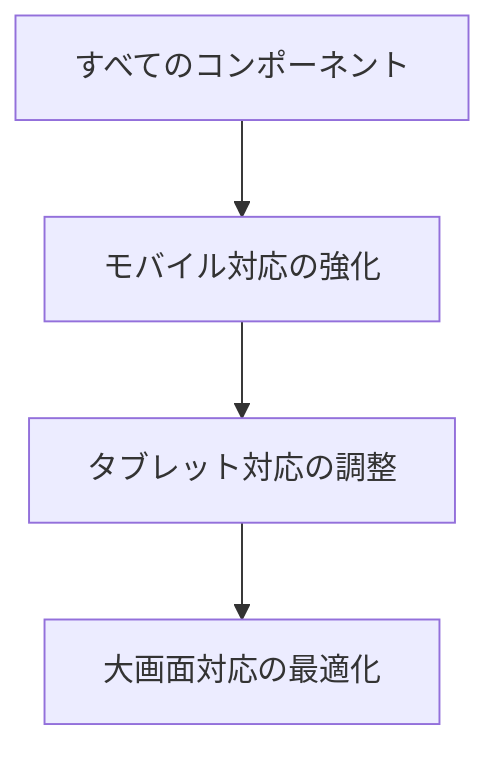

**作業内容:**
- すべてのコンポーネントとページでのレスポンシブデザイン強化
- モバイルファーストでのスタイル調整
- メディアクエリの統一と最適化

## 実装の注意点

1. **段階的アプローチ**：一度にすべてを変更するのではなく、段階的に実装して各フェーズで確認する

2. **コンポーネント分離**：再利用可能なコンポーネントを作成し、コードの重複を避ける

3. **型の活用**：TypeScriptの型を適切に利用し、データの整合性を確保する

4. **パフォーマンス考慮**：画像最適化やCSSの効率的な構造化を考慮する

5. **アクセシビリティ対応**：対比の確保、キーボード操作、スクリーンリーダーのサポートなど

6. **テスト**：各フェーズで異なるデバイスサイズやブラウザでのテストを実施

## 2025年3月4日の追加調整項目

### 1. ピックアップエリアのレイアウト調整

- 左側（広いエリア、2fr）にメインカード1つを縦型レイアウトで配置
- 右側（狭いエリア、1.5fr）にサブカード3つを横型レイアウトで配置
- メインカードのアイキャッチ画像比率を16:9に変更して縦幅を抑制
- サブカードは左側に小さなアイキャッチ（35%幅）、右側にテキスト情報
- 全体の余白とギャップを縮小して、よりコンパクトに

### 2. 日付表示の改善

- 「今日」「昨日」「○日前」「○週間前」「○ヶ月前」「○年前」の相対日付表示を実装
- 絶対日付をtitle属性に設定し、マウスホバー時に詳細情報表示
- 日付を左寄せに統一

### 3. UI要素の調整

- 「最新」バッジを削除
- ピックアップセクションのタイトル「ピックアップ」を削除
- カテゴリ名を日本語から英語に変更（「ブログ記事」→「Blog」、「ノート」→「Note」）
