これまでここには自分用のまとめくらいにしか記事を書いていなかったのでデザインもかなり適当だったのですが、[前回](https://yaakai.to/blog/2025/create-eye-catching-visuals-with-ai/)のをきっかけに人が見れるレベルにしたいなと思ったので、 Roo Code とやってみることにした。

## 前提

- Tier 4 の 3.7 Sonnet (thinking)
- Cursor Pro を使うこともある

## Architect is

Roo Code には実行モードがデフォルトでいくつかあってその一つ、 Cline だと「Plan」と呼ばれているもののはずで、コード生成をせずに設計を行うモード。
いきなり実装に入るよりも、こっちで計画を立ててから実装に映るのがよいと言われている。

同一コンテキストであればモードの切替でよいと思うが、今回は全体を書き直させたかったので一回じゃ足りないだろうなと思い、何かしらの記憶領域を使いたかった。
こんな感じのフローで進めたい:

1. Architect モードでどんなデザインにするかを相談する
2. 話した内容をどこかにプランとして保存する
3. 別の Code モードの Task で、プランを元に実装を進めて、進捗を記録する
4. Content Window が足りなくなったら、それまでの実行結果を持って新しい Task に移動する

先に言っておくと、意図せず Context Window が足りなくなるということが今回なかったので、各タスクは基本的にすべて完遂しているという前提で話が進む。

## 保存と記録をどうするか

Cline 公式のドキュメントに Memory Bank というものがあって、これは現在のコードベースや進捗状況を書き出しておくことで、それを元に会話を進めることができるという考え方らしい。

- https://docs.cline.bot/improving-your-prompting-skills/custom-instructions-library/cline-memory-bank

そういうのがある、という知識としてはあったので、今回のリデザイン作業をする前にこの Memory Bank のプロンプトは動かしてみていたのだけど、個人的には微妙だなと感じていた。
あくまで初学者の自分がそう感じているだけで、使い方が間違っているとか、使いこなせば便利なんだろうなという気はするが、次のような点が気になった:

- activeContext が今回一番気になっていたが、更新されるタイミングがイマイチ掴めず
- follow your custom instructions / update memory bank みたいなコマンド前提なのがちょっと面倒くさい
- 多人数での利用に適したものなのか疑問、これは全く感覚が掴めなかったという話

そんな感じだったのでこれを使うのはやめて(というか放置して)、もっとシンプルに `plan.md` と `state.md` というファイルを作ってみることにした。前者には Architect モードでの計画を吐き出してもらって、実装のたびに後者を更新していくようなイメージ。
リデザインに限らず「Architect で相談 → Code で実装 → 状態を記録 → Code で実装 ...」という流れで何かしらを開発するとして、その一連の流れはリポジトリ全体で見ると一時的で個人的なイベントであるため、それを共有するような形にしても嬉しくないんじゃないかなというのもあった。

## Architect で計画を立ててもらう

GitHub のブログや CircleCI のブログがいい感じだなと思っていたので、スクリーンショットしてそれを参考にやってもらうことにした。
Cursor を使っているときもこの方法をよく使っていて、実装してもらいたい UI のスクリーンショットを取ってプロンプトに添付していた[^1]。

[^1]: 添付という表現があっているのかはわからない

文字のプロンプトとしては以下で、これに画像が 2 つ付く感じ。

```
@/web/ を画像のようなデザインに変更したいので、どういう方針で進めていくかを考えてください
また、次の仕様を満たしてください:

- ダークテーマとライトテーマの両方に対応
- グレースケールを中心としつつも、赤をアクセントとして使っていく
- ブログとノートはトップレベルでは混合させてもよい
    - ただし、大きく表示してよいのはブログだけにする
```


かなり雑な感じだけど、 Figma なりでデザインがあるわけでもなくなので、話しながら進められればいいかなくらいの感覚だった。
そうするとこんな感じでいろいろ出してくれるので中身を確認する。


なにかあったら言ってねと言われるので、計画を見て間違ってそうなところを直してもらう。

```
単体の記事を表示するヒーローセクションは不要で、4 つの記事を組み合わせるようなコンポーネントを作ってください。
左には大きく最新のブログを 1 つ、右にはブログとノートの区別なく最新の 3 つを表示します。ただし、左と右でコンテンツに重複がないようにします。
```


計画が更新されてくので、同じ手順とノリで満足するまで繰り返した。
だいたい出来たあたりでこんな感じの質問があって、

```
Roo has a question:
実装プランの詳細ありがとうございます。コンポーネント作成が必要とのことですが、まだAstroプロジェクトにcomponentsディレクトリがないようです。この部分について、どのように進めるべきでしょうか？また、デザインを実装する際の優先順位はどのように考えていますか？
```

```
components ディレクトリは作っても構いませんが、 astro contents を採用する予定がないので、それは使わないでください
優先順位はなんでもいいのでお任せします
```

こう答えたら、実装を始めていいと勘違いしたのか Code モードに切り替えようとしたので一旦止めた。内容としてはこれくらいでよかったので、ついでに `plan.md` を作ってもらう。

```
code モードに切り替える前に、ここまでの計画を plan.md にまとめて保存して
```

するとこんな感じに計画を作ってくれる、長すぎるので折り畳めるようにしたい。

````
# yaakai.to ウェブサイトリデザイン計画

## 全体コンセプト

- グレースケールをベースにした、赤色アクセントのモダンなデザイン
- ブログとノートを視覚的に区別するレイアウト
- ブログ記事を大きく表示し、ノートをコンパクトに表示
- ダークモードとライトモード両対応
- YouTubeチャンネルページのようなカテゴリ分けのある構造

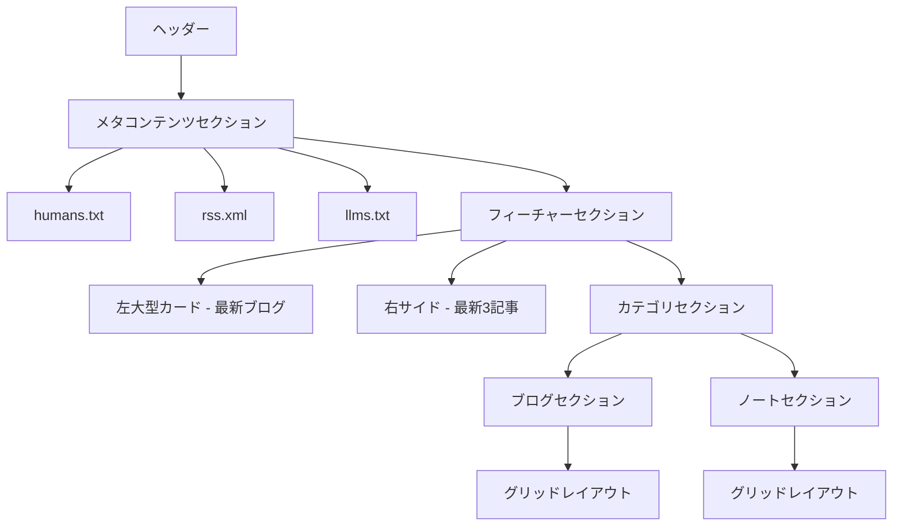

## カラースキーム

```css
:root {
  /* グレースケールパレット - ライトモード */
  --gray-100: #FFFFFF;
  --gray-200: #F9F9F9;
  --gray-300: #F0F0F0;
  --gray-400: #E0E0E0;
  --gray-500: #C0C0C0;
  --gray-600: #808080;
  --gray-700: #505050;
  --gray-800: #303030;
  --gray-900: #121212;

  /* アクセントカラー - 赤色系 */
  --red-500: #E53935;
  --red-600: #D32F2F;
  --red-700: #C62828;

  /* 機能的な色の割り当て */
  --bg-color-level-0: var(--gray-100);
  --bg-color-level-1: var(--gray-200);
  --bg-color-level-2: var(--gray-300);
  --bg-color-level-3: var(--gray-400);
  --bg-color-level-4: var(--gray-500);

  --text-color-level-0: var(--gray-900);
  --text-color-level-1: var(--gray-800);
  --text-color-level-2: var(--gray-700);

  --primary-color-level-0: var(--red-600);
  --primary-color-level-1: var(--red-500);
  --primary-color-level-2: var(--red-700);

  /* コンテンツタイプ識別色 */
  --blog-color: var(--red-600);
  --note-color: var(--gray-600);
}

@media (prefers-color-scheme: dark) {
  :root {
    /* ダークモード用の色の割り当て */
    --bg-color-level-0: #121212;
    --bg-color-level-1: #1E1E1E;
    --bg-color-level-2: #2D2D2D;
    --bg-color-level-3: #353535;
    --bg-color-level-4: #424242;

    --text-color-level-0: #FFFFFF;
    --text-color-level-1: #E0E0E0;
    --text-color-level-2: #BDBDBD;

    --primary-color-level-0: #F44336;
    --primary-color-level-1: #EF5350;
    --primary-color-level-2: #E53935;

    /* ダークモードでのコンテンツタイプ識別色 */
    --blog-color: #FF5252;
    --note-color: #A0A0A0;
  }
}
```

## コンポーネント設計

### 1. ヘッダー
- シンプルなナビゲーション
- サイト名とアイコン
- ブログとノートへのリンク

### 2. メタコンテンツセクション
- humans.txt セクションの表示（現在と同様の表示スタイル）
- humans.md の内容を表示
- rss.xml へのリンクを追加
- llms.txt へのリンクを追加
- メタコンテンツへのリンクを視覚的にまとめて配置

### 3. フィーチャーセクション
- 非対称グリッドレイアウト
- 左側に大きなカード（最新ブログ記事）
- 右側に3つの小さなカード（最新記事）
- グリッドベースで水平スクロールなし

```css
.feature-section {
  display: grid;
  grid-template-columns: 3fr 2fr;
  gap: 24px;
  margin-bottom: 48px;
}

.feature-main {
  grid-column: 1;
  grid-row: span 3;
}

.feature-sub {
  grid-column: 2;
  display: flex;
  flex-direction: column;
  gap: 16px;
}
```

### 4. カテゴリセクション
- 各カテゴリごとのセクション（ブログ、ノートなど）
- カテゴリ名と「もっと見る」リンクを含むヘッダー
- レスポンシブグリッドレイアウト
- コンテンツタイプの視覚的区別

```css
.category-section {
  margin-bottom: 48px;
}

.category-header {
  display: flex;
  justify-content: space-between;
  align-items: center;
  margin-bottom: 24px;
}

.category-grid {
  display: grid;
  grid-template-columns: repeat(auto-fill, minmax(250px, 1fr));
  gap: 24px;
}
```

### 5. カードデザイン

#### ブログカード
- 大きな画像/サムネイル
- 赤色アクセントのインジケーター
- タイトル、日付、概要テキスト

#### ノートカード
- コンパクトなデザイン
- グレースケールベース
- 絵文字とタイトルを主体に

## レスポンシブデザイン

### デスクトップ (1024px以上)
- フィーチャーセクション：非対称グリッド (3:2)
- カテゴリグリッド：4列

### タブレット (768px - 1023px)
- フィーチャーセクション：非対称グリッド (3:2)
- カテゴリグリッド：2-3列

### モバイル (768px未満)
- フィーチャーセクション：1列
- カテゴリグリッド：1列

# 実装プラン

## コンポーネント構造について

Astro Contentsは使わず、コンポーネントは以下のように実装します：

1. **src/components ディレクトリを新規作成**：
   - 再利用可能なUI要素をコンポーネントとして実装
   - 各コンポーネントは独立した.astroファイルとして作成

2. **コンポーネント名の例**：
   - `BlogCard.astro`
   - `NoteCard.astro`
   - `FeatureGrid.astro`
   - `CategorySection.astro`

## ディレクトリ構造

```
src/
├── components/     <- 新規作成
│   ├── BlogCard.astro
│   ├── NoteCard.astro
│   ├── FeatureGrid.astro
│   └── CategorySection.astro
├── layouts/        <- 既存
│   ├── global-layout.astro
│   └── blog-post.astro
└── pages/          <- 既存
    ├── index.astro
    ├── blog/
    └── note/
```

## 実装の優先順位

1. **グローバルスタイルの更新**
   - カラースキームの変更
   - 基本レイアウト構造の改善
   - タイポグラフィの更新

2. **コアコンポーネントの作成**
   - カードデザイン
   - グリッドレイアウト
   - セクションヘッダー

3. **トップページの再構築**
   - フィーチャーグリッド
   - カテゴリセクション
   - レスポンシブデザイン対応

4. **各ページの更新**
   - ブログインデックスページ
   - ノートインデックスページ
   - 記事詳細ページ

## 詳細実装ステップ

### フェーズ1: グローバルスタイルとレイアウトの更新

#### 1-1. カラースキームの更新
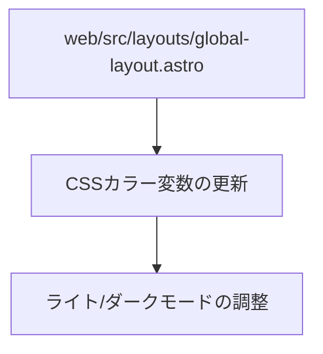

**作業内容:**
- `web/src/layouts/global-layout.astro` ファイルの CSS 変数を更新
- グレースケールベースのカラーパレットを実装
- 赤色アクセントカラーの設定
- ブログとノートの識別色の設定

#### 1-2. 基本レイアウトの更新
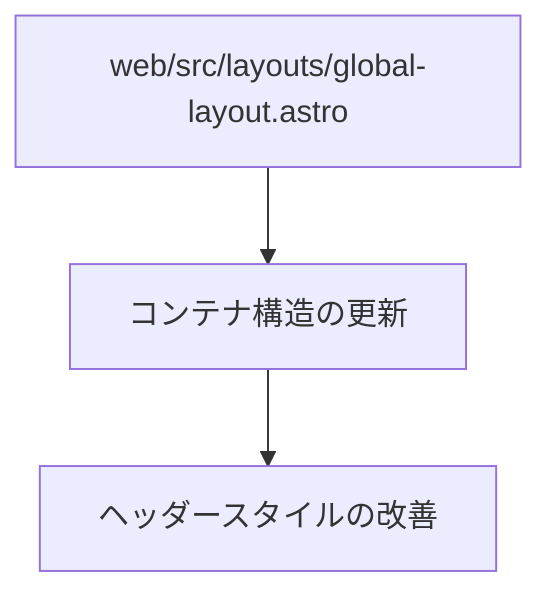

**作業内容:**
- ページ全体のコンテナサイズと余白の調整
- ヘッダーのデザイン更新
- 基本的なグリッドレイアウトの準備

### フェーズ2: コンポーネントの作成

#### 2-1. カードコンポーネントの作成
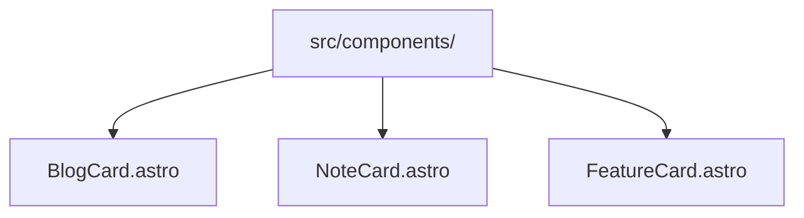

**作業内容:**
- `src/components/` ディレクトリを作成
- ブログ用カードコンポーネントの実装
- ノート用カードコンポーネントの実装
- フィーチャーセクション用の大型カードコンポーネントの実装

#### 2-2. セクションコンポーネントの作成
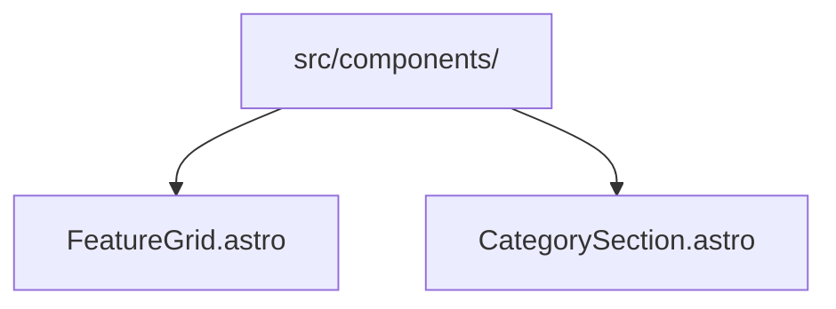

**作業内容:**
- フィーチャーグリッドコンポーネントの実装
- カテゴリセクションコンポーネントの実装
- 各セクションのレスポンシブデザイン対応

### フェーズ3: トップページの再構築

#### 3-1. メタコンテンツセクションの更新
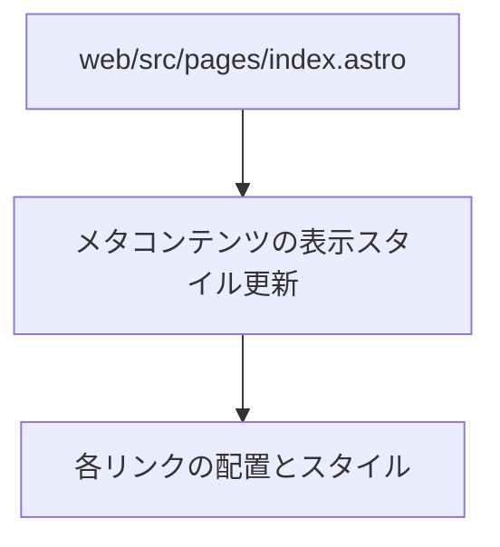

**作業内容:**
- humans.txt セクションのスタイルを更新
- rss.xml と llms.txt へのリンクを追加
- メタコンテンツをグループとして視覚的にまとめる
- 新しいデザインテーマに合わせたスタイル調整

#### 3-2. フィーチャーセクションの実装
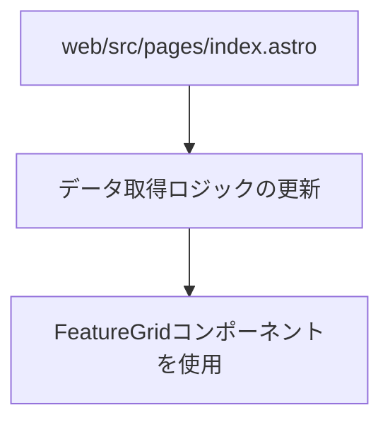

**作業内容:**
- ブログとノートの記事データ取得ロジックの改善
- 最新記事を取得して、左側に最新ブログ、右側に残りの最新記事を配置
- フィーチャーグリッドコンポーネントを使用して表示

#### 3-3. カテゴリセクションの実装
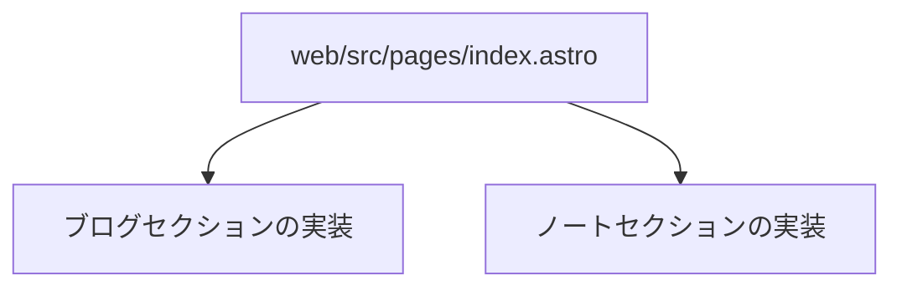

**作業内容:**
- ブログ記事用のカテゴリセクション実装
- ノート用のカテゴリセクション実装
- CategorySectionコンポーネントを使用して表示

### フェーズ4: 各ページの更新

#### 4-1. ブログページの更新
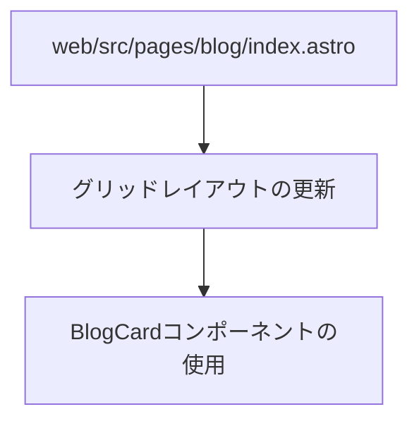

**作業内容:**
- ブログインデックスページのレイアウト更新
- カテゴリフィルターの追加（将来機能）
- BlogCardコンポーネントを使用した記事表示

#### 4-2. ノートページの更新
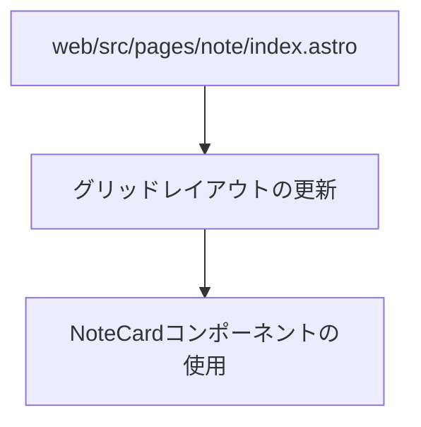

**作業内容:**
- ノートインデックスページのレイアウト更新
- NoteCardコンポーネントを使用した記事表示

### フェーズ5: 詳細ページとレスポンシブ対応

#### 5-1. 記事詳細ページの更新
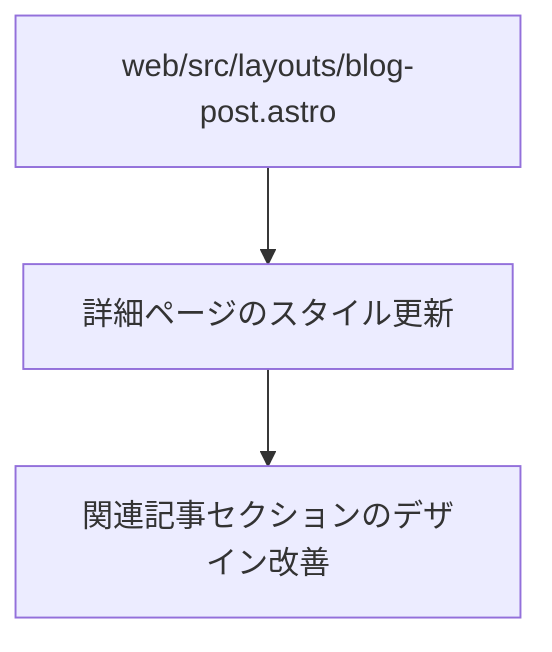

**作業内容:**
- 記事詳細ページのレイアウト更新
- Markdownスタイルの調整
- 関連記事セクションのデザイン改善

#### 5-2. レスポンシブデザインの最適化
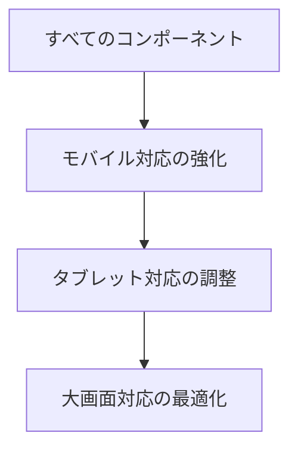

**作業内容:**
- すべてのコンポーネントとページでのレスポンシブデザイン強化
- モバイルファーストでのスタイル調整
- メディアクエリの統一と最適化

## 実装の注意点

1. **段階的アプローチ**：一度にすべてを変更するのではなく、段階的に実装して各フェーズで確認する

2. **コンポーネント分離**：再利用可能なコンポーネントを作成し、コードの重複を避ける

3. **型の活用**：TypeScriptの型を適切に利用し、データの整合性を確保する

4. **パフォーマンス考慮**：画像最適化やCSSの効率的な構造化を考慮する

5. **アクセシビリティ対応**：対比の確保、キーボード操作、スクリーンリーダーのサポートなど

6. **テスト**：各フェーズで異なるデバイスサイズやブラウザでのテストを実施

````

内容があっているかを確認する、多分いい感じ。 `plan.md` も作ってもらう。

```
タスクが完了するごとに、plan.md をどこまで進めたかを state.md として書き出すようにして
```

````
**最終更新**: 2025年3月4日

## 概要
yaakai.toウェブサイトをモダンなグレースケールベース + 赤色アクセントのデザインに更新するプロジェクト。ブログとノートを視覚的に区別するレイアウトを実装し、YouTubeチャンネルページのようなカテゴリ分けを導入します。

## 現在の進捗状況

### フェーズ1: グローバルスタイルとレイアウトの更新
- [ ] 1-1. カラースキームの更新
- [ ] 1-2. 基本レイアウトの更新

### フェーズ2: コンポーネントの作成
- [ ] 2-1. カードコンポーネントの作成
- [ ] BlogCard.astro
- [ ] NoteCard.astro
- [ ] FeatureCard.astro
- [ ] 2-2. セクションコンポーネントの作成
- [ ] FeatureGrid.astro
- [ ] CategorySection.astro

### フェーズ3: トップページの再構築
- [ ] 3-1. メタコンテンツセクションの更新
- [ ] 3-2. フィーチャーセクションの実装
- [ ] 3-3. カテゴリセクションの実装

### フェーズ4: 各ページの更新
- [ ] 4-1. ブログページの更新
- [ ] 4-2. ノートページの更新

### フェーズ5: 詳細ページとレスポンシブ対応
- [ ] 5-1. 記事詳細ページの更新
- [ ] 5-2. レスポンシブデザインの最適化

## 次のステップ
1. グローバルレイアウトのカラースキームを更新
2. 基本レイアウト構造の改善
3. コンポーネントディレクトリを作成し、初期コンポーネントを実装

## 備考
- 計画は [plan.md](./plan.md) に詳細に記述されています
- デザインはグレースケールベースに赤色アクセントを組み合わせたモダンなスタイル
- ブログとノートは視覚的に区別されるデザインを採用
- メタコンテンツ（humans.txt、rss.xml、llms.txt）はトップレベルでグループ化
````

それっぽいのが出てきた。そして実装に移ろうとするので、待てして Task を引き継ぐためのプロンプトを考えてもらう。


## 実装してもらう

教えてもらったプロンプトを少し変更してして、`@` でファイルを読むようにした。

```
@/web/plan.md  に記載された計画に従って、yaakai.toウェブサイトのリデザイン実装を進めてください。まずは @/web/src/layouts/global-layout.astro のカラースキーム更新から始め、計画の各フェーズを順番に実装していってください。各ステップが完了するたびに @/web/state.md を更新して進捗を記録してください。最初に計画と現在の進捗状況を確認して、実装を開始してください。
```

プロンプトに `plan.md` がちゃんと含まれている図:


確認できたみたいで、計画されていたカラースキームの変更から実装が始まっていく：


すべては貼れないので一部を抜粋すると、計画された順に実装を進めていこうとしていることがわかる:


ただ、 `state.md` はというと↑の画像くらいのタイミングで進捗を更新してほしかったが、今回のプロンプトだとそれは叶わなかった。
こんな感じに最後にまとめてこの Task でやった分を更新してくれた:


Context Window が足りている分にはこれでも構わないが、自分はそれが途切れたときに `state.md` からある程度状態を復元できることを期待していたので、もっとフェーズを進めるごとにガンガン書き込んでほしかった。
Web の情報を見ていると、そういう動きをしているものもあるように思うので、これはまたあとに試す予定。

あとは同じような手順で、新しい Task を作るときは `plan.md` と `state.md` を読み込み更新しながら実装を進めていった。
実際どの程度の効果があったかを説明するのは難しいが...、以前にやったときは「今お前が壊したそれこの前お前が直したじゃん」みたいなことがあったけど、そういう手戻りみたいなことはなかったように思う。

## CSS をうまく書けないので覚えてもらう

そういう話題に関連することとして、ミクロな話だと少し複雑な CSS を頑張って実装しても次の瞬間には忘れて破壊する、というのがあった。
具体的にはアイキャッチを 2 つのコンテナを跨いでいるように見せるという実装。


うまくいかない話

で、最終的にはこれは自分が手で実装することにした。そこまではよいのだけど、問題は次にその周辺を触ったときに、必ずその実装が破壊されて Task が完了するごとに戻っていた。
これを解決しないと先に進めないので、実装方針を説明して `plan.md` や `state.md` に書いてもらう、というのを試した。

```
アイキャッチが記事本文側の要素に少しずれているような視覚効果を実現します。
あなたはいままでこれの実装を何度も失敗しているので、私がいう実装方法を覚えてください。

1. .article-header の bottom の padding や margin  を削除して、アイキャッチの下が .article-header の終端と合うようにします
2. .eyecatch-container の兄弟として新たな要素を挿入します、これは記事側と同じ背景色を持ちます
3. この要素を z-index で .eyecatch-container より下にした状態で、 position: absolute; で高さ 80px を持ちつつ、.article-header の終端に合うよう固定します
```

なるべく頑張って実装を説明した、これを入れたのはぶっ壊れたあとなので、 AI が自身でこの実装を修正する必要があった。
この指示はかなりうまくいって、過去に実装された事実があるとはいえ、望んでいたものが改めて AI によって実装された。


その後 `plan.md` や `state.md` を更新してもらうと、それらを含めている限りはここに関する手戻りは発生していないように思えた。えらい。


## 雑感

### 計画を吐き出すのは良さそう

`plan.md` は結構いいように思えたので使っていきたい。 `state.md` はどのくらい効果があったのか肌感がない、わざわざ分ける必要はないかも。

### 個人用のメモスペースがほしい

`plan.md` なんかを自由に作れるスペースがリポジトリ内にほしい。AI との会話の成果物を一時的に保存する場所が gitignore されてリポジトリに確保されているといいなと思った、今回は commit してしまったが...。
先にも書いたが、全体で共有したいルールがある一方で、個人が一つの作業で使う一時記憶ファイルを全部 commit したいとはならなさそう。そのファイル自体もバージョン管理したいという気持ちもあるので、 submodule なのか...？

### 複雑なコードは個別の取説を置きたい

マスターデータとなるデザインデータなんかが存在しない中では仕方ないことなのかもしれないが、 HTML + CSS な UI 構築に関しては自分が手を出さないといけないことが多い気がしている、もちろん詳細なデザインは妥協しているが。
今回のような内容をすべてプロンプトに含めるわけにもいかないので、コンポーネントのような単位でその実装を説明した 取説.md を横においておき、コンポーネントを触るときはその取説を参照させるような仕組みが出来るといいのかもしれない。
と思っていたけど、大抵はコメントとして残しておけば解決する話なのかもしれない。
